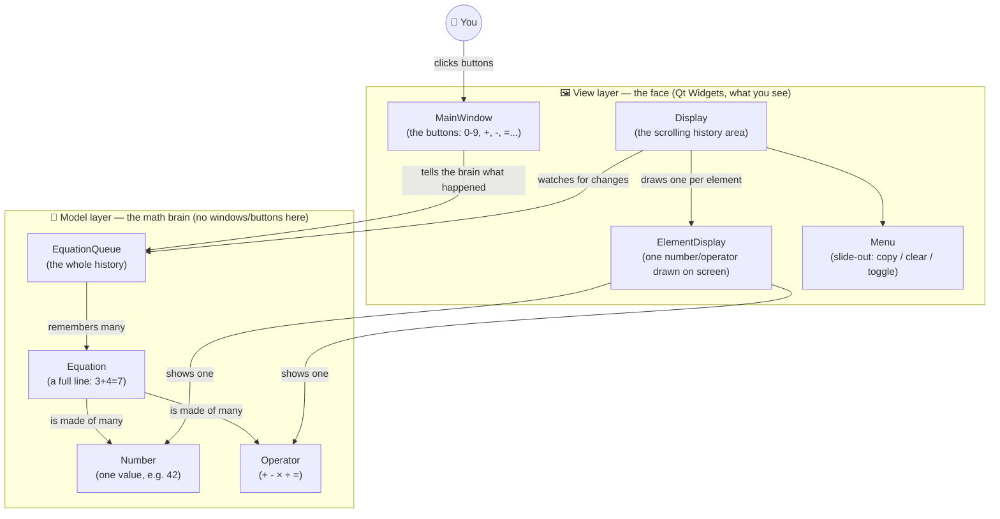

# Build-It-Yourself: CalculatorWithHistory Learning Plan

A step-by-step curriculum for building a Qt calculator app from an empty
folder, aimed at a **complete beginner**. Each phase adds exactly one big
new idea, produces something that actually runs, and ends with a small
celebration moment ("look what you just built!").

This plan lives next to the code so progress and explanations stay
together. Suggested pace: **one phase per sitting** (45–90 minutes each).
Commit to git at the end of every phase so she can literally see the
project grow, one commit at a time.

---

## 0. Tooling checklist (done once, together)

| Tool | Status on this machine | Notes |
|---|---|---|
| CMake | ✅ installed (4.4.2) | Build system: turns source files into a program |
| C++ compiler (MinGW-w64 g++ 16.2, UCRT) | ✅ found at `C:\mingw64-toolchain\mingw64\bin` | Turns C++ text into an `.exe` |
| Qt 6 (Widgets) | ❌ not installed yet | Only needed starting **Phase 2**. Install via the [Qt Online Installer](https://www.qt.io/download-qt-installer), choosing the **MinGW 64-bit** kit (must match the compiler above) and the **Qt Widgets** component. |
| Editor | Your choice | VS Code (with the C/C++ and CMake Tools extensions) or Qt Creator both work great. |

We already proved the CMake + compiler combo works: a "Hello World"
console app was configured, built, and run successfully in
[CalculatorTutorial](/d:/Learn-more/CPP/CalculatorTutorial).

---

## The big picture: what we're building

A calculator where every equation you type stays visible above the
current one, shrinking into "history," and numbers that repeat between
calculations get connected with a colored dashed line — like a memory
that shows its work.



**Key idea we're teaching along the way:** keep the *math* (Model) and
the *pictures on screen* (View) as separate as possible. This is called
the **Model-View pattern**, and it's one of the most important ideas in
all of software design — small apps and huge apps both use it.

---

## Phase overview

| # | Phase | Big new idea | Needs Qt? |
|---|---|---|---|
| 0 | Setup | Compiler, CMake, "hello world" | No |
| 1 | Console calculator | Variables, functions, if/else | No |
| 2 | First Qt window | GUI, events, signals & slots | **Yes** |
| 3 | The math brain (classes) | Classes, inheritance, `Equation` | No (console test) |
| 4 | Connect brain to face | Model-View pattern, custom signals | Yes |
| 5 | History list | Containers (`deque`), dynamic layouts | Yes |
| 6 | Make history look old | Fonts, colors, polish | Yes |
| 7 | The "wow" feature | Custom painting, matching numbers | Yes |
| 8 | Menu & extras | Animation, clipboard, tooltips | Yes |
| 9 | Ship it | Icons, shortcuts, packaging | Yes |

---

## Phase 0 — Setup & "Hello, Compiler!"

**Goal:** Make sure every tool works before writing anything interesting.

**New concepts (explain simply):**
- A **compiler** translates C++ text into a program the computer can run.
- **CMake** is a recipe that tells the compiler which files to combine and how.
- Nothing "graphical" yet — just proving the pipeline: *code → build → run*.

**What you build:** `src/main.cpp` that prints a friendly message, plus a
`CMakeLists.txt` recipe. ✅ Already created and verified in this folder —
run it together on her machine so she performs the "build" and "run"
steps herself.

**Steps to run Phase 0 (type these in a terminal, from this folder):**
1. **Configure** (reads `CMakeLists.txt` and generates build files, using
   the MinGW-w64 compiler as the toolchain):
   ```
   cmake -S . -B build -G "MinGW Makefiles"
   ```
2. **Build** (compiles `src/main.cpp` into `build/CalculatorTutorial.exe`):
   ```
   cmake --build build
   ```
3. **Run** (launches the program and prints the message to the terminal):
   ```
   .\build\CalculatorTutorial.exe
   ```

Step 1 only needs to be re-run if `CMakeLists.txt` changes or the `build`
folder is deleted; steps 2–3 are what you repeat every time you change
`main.cpp`.

**Milestone / Definition of Done:** She types the build command herself,
sees it compile, and sees her message printed in the terminal.

---

## Phase 1 — Console Calculator (pure C++, no Qt)

**Goal:** Learn the raw building blocks of programming using nothing but
text input/output — no GUI distractions yet.

**New concepts:**
- Variables and types (`double`, `char`)
- Reading input (`std::cin`) and printing output (`std::cout`)
- `if` / `else if` to choose between `+ - * /`
- Functions (put the math in its own function, call it from `main`)
- Basic error handling (what happens on divide-by-zero?)

**What you build:** A program that asks "Enter first number, operator,
second number" and prints the result. Something like:
```
Enter calculation (e.g. 3 + 4): 3 + 4
= 7
```

**Milestone:** She can calculate `+ - * /` on two numbers from the
terminal, and explain in her own words what a *function* is.

---
