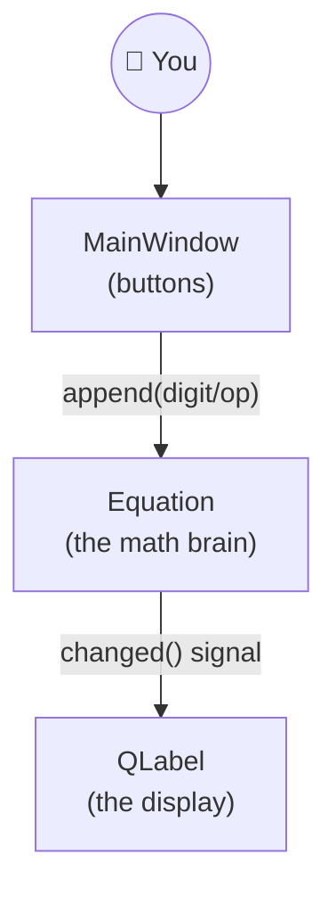

# Calculator_Project

## Phase 3: GUI Calculator

A GUI-based calculator developed in C.

## Features

- User-friendly graphical interface
- Addition (+)
- Subtraction (-)
- Multiplication (*)
- Division (/)
- Clear button
- Displays the entered numbers and results
- Handles division by zero
- Simple and easy-to-use calculator interface

## Concepts Used

- C Programming
- GUI Widgets
- Functions
- Variables and Data Types
- Conditional Statements
- Event Handling
- User Input Handling

## Technologies Used

- C
- Qt
- CMake

## Project Structure

```text
Calculator_Project/
│
├── CMakeLists.txt
├── main.c
├── README.md
└── ...


